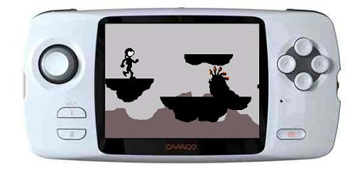

CaanooPlatformer
================

Demo created for the Caanoo handheld device using C++ and the SDL library with the purpose of testing component-based architecture.

 

 

DEMO

To play the pc version, go in the demo folder and double-click the executable file.
Altering or removing any of the other files in the demo folder may cause the game to crash.

INSTRUCTIONS

Move the player with the right and left arrows, use the space bar to jump and press "b" to fire bullets.

Touching an alien, being hit by a projectile or falling will cause the player to die and re-spawn at the beginning.
